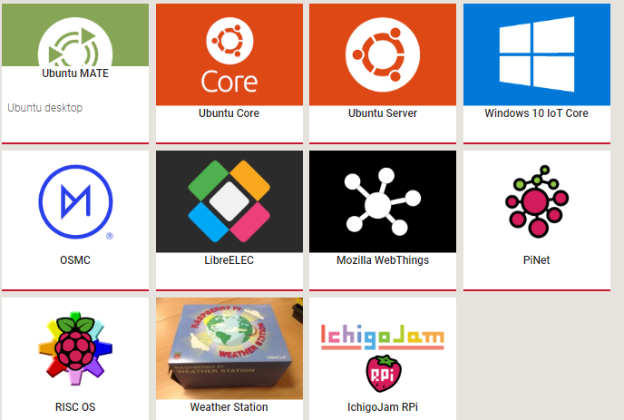
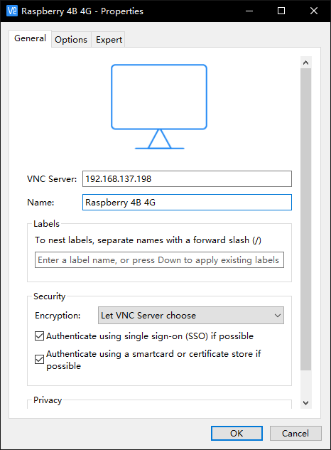

###  树莓派4B入手教程

#### 一、烧录系统

##### 1.1系统介绍

树莓派入手后第一件事便是安装系统，树莓派官网提供了许多系统供用户下载，包括*win10、Ubuntu、Raspbian*等系统


*Raspbian*是树莓派官方为树莓派制作的系统，基于Debian。



[树莓派系统下载，请点击这里](https://www.raspberrypi.org/downloads/ '树莓派系统下载')

我下载的是*Raspbian*，树莓派的官网给出了三个*Raspbian*系统镜像


**Raspbian Buster with desktop and recommended software**是具有图形界面的*Raspbian*，安装有一些官方推荐的软件。我购买的是第四代树莓派故而我选择这个系统

**Raspbian Buster with desktop**与上面相同只不过没有安装官方的推荐的软件。

**Raspbian Buster Lite**命令行版无图形化界面，通常是对图形化界面没需求，或者购买的树莓派性能相对较低，如：Zero W

#####  1.2系统安装

以**Raspbian Buster with desktop and recommended software**为例，在官网上下载后，解压，得到系统镜像文件。

这里需要将内存卡进行格式化处理，我使用的软件是**SDFormatter**，格式化好之后便进行烧录过程。这里我使用的是**Win32DiskImager**，打开后选择系统镜像，并选择作为系统盘的内存卡，写入。等待一段时间。

到了这里系统烧录便完成了。但是由于我为了挑（sheng)战(qian)，我并没有购买一个小的显示屏，并且寝室没有显示屏可以供我使用。故而还需要进行另外的操作。如果有显示屏就只需要插入HDMI线便可以显示了，再接入键盘鼠标便可以开心使用树莓派了。树莓派4自带有网线插口，可以通过插入网线连接到网络在通过查找到树莓派的ip通过ssh连接。但是，*学校网络*需要账号登录所以插入网线的方法并不适用我的树莓派4。所以我既没有显示器也没有*网线*。还好树莓派都自带WIFI模块，可以通过配置实现连接到树莓派。

#### 二、无显示屏，无网线插入使用树莓派

##### 2.1 配置wpa_supplicant.conf文件

树莓派3B发布后，*Raspbian*系统加入了一个机制——用户可以在开机前对WIFI网络进行配置。

> 这个方法需要全新安装树莓派系统到SD卡之后**没有做过任何WIFI配置**的情况

在刚刚烧录系统完成的基础上打开boot盘，在里面新建一个文件名为*wpa_supplicant.conf*的文件，在里面写入
```
country=CN
ctrl_interface=DIR=/var/run/wpa_supplicant GROUP=netdev
update_config=1
 
network={
ssid="wifi_name1"
psk="wifi_code"
key_mgmt=WPA-PSK
priority=5
}
network={
ssid="wifi_name2"
psk="wifi_code"
key_mgmt=WPA-PSK
priority=4
}
```

这里可以填写多个*network*每一个*network*代表一个无线网络配置，*ssid*，*psk*分别是账号和密码。*key_mgmt*则是WIFI的加密方式。*priority*是WIFI连接的优先级设置好后，当存在多个配置的WIFI时的连接顺序。当树莓派插上电源后便可以连接到网络。之后通过查找树莓派在内网的ip地址再通过ssh连接便可以使用了。为了以防万一我在写入wpa_supplicant.conf文件后还创建了一个ssh没有后缀的文件来开启ssh服务

##### 2.2 远程连接树莓派

可以通过手机热点、电脑共享的WIFI、无线路由器等方法提供WIFI信号，这里**我通过电脑共享的WIFI来实现**。通过打开设置查看已经连接的设备的IP地址

树莓派默认的设备名称是***raspberry***，复制IP地址，打开ssh连接的软件。输入IP地址并点击open。

在弹出的窗口里面输入登录的用户名：pi（*树莓派默认用户名为pi*）


再输入密码：raspberry（*默认密码为raspberry*)


之后便可以像使用Linux终端一样使用啦。

#### 三、VNC连接树莓派，实现远程图形化显示

因为我没有显示器，但是我有笔记本、平板、手机呀。我可以使用这些的屏幕作为显示屏，但是HDMI的方式似乎并不成功。***这些设备只支持信号输出而不支持信号输入***。但是树莓派自带VNC功能（*包括树莓派4*）

##### 3.1 开启VNC服务

在通过ssh连接的终端界面下输入
``` shell
sudo raspi-config
```

**这里需要注意**，*ESC*是退出，*方向键*控制上下，*回车*是确认。选择*Interfacing Options*

再选择*VNC*，回车


选择*是*，回车。


> 值的注意的是，之后如果VNC连接后存在现实不完全的情况则需要选择7 Advanced Optins，A5 Resolution 中进行修改分辨率；语言问题则可以在4 Localisation Options Set up 中选择 Change Locale中进行更改。

到这里树莓派的VNC服务便开启完成了

##### 3.2 VNC Viewer连接

[VNC Viewer](https://www.realvnc.com/en/connect/download/viewer/)下载，并安装完成。

> 建议注册个免费账号可以享受5个免费的团队地址，只要目标设备安装了VNC Server并且登录了该账号，便可以在登录了该账号的VNC Viewer上进行连接（前提，双方都联网了！）

打开，在*file*中点击*New connections*输入IP地址和Name



点击*OK* 后打开刚刚建立的***Connection***

输入账号密码


便可以进入树莓派4B了。


> 安装完成树莓派后，还可以上国内国外各大坛论，油猴子等去学习别人的骚操作。